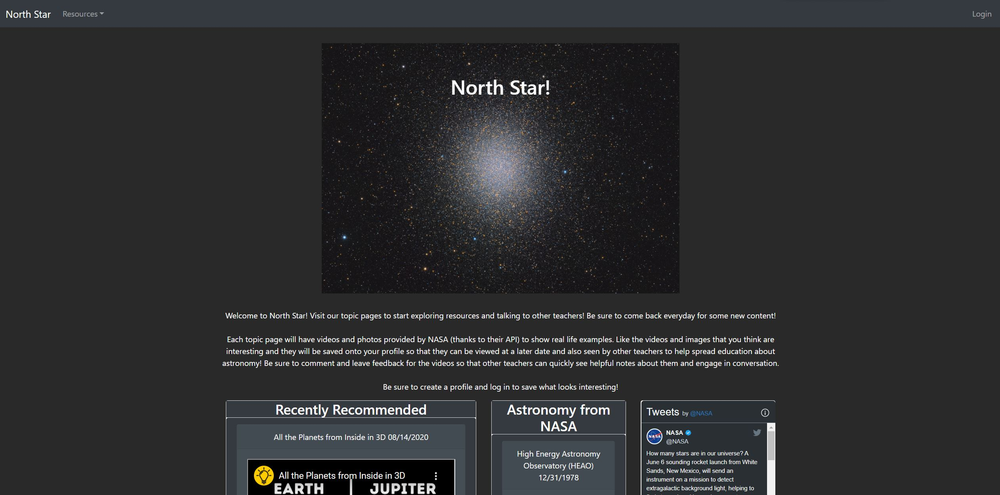
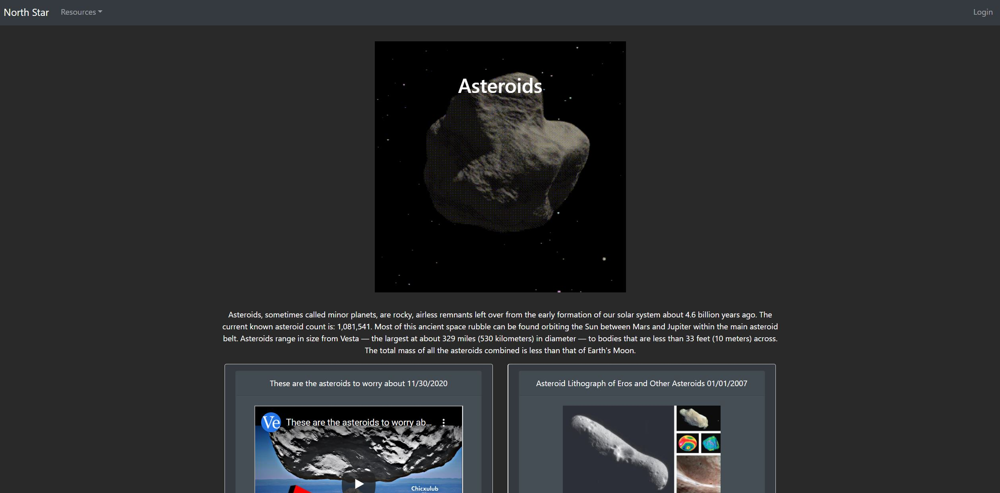

# North Star

## Team

Colin Bell - [cobell206](https://github.com/cobell206)

Mike Coletta - [MikeColetta](https://github.com/MikeColetta)

Debasu Eyasu - [bayleyegn100](https://github.com/bayleyegn100)

Haram Kwon - [kharam](https://github.com/kharam)

Parm Singh - [parmbir21](https://github.com/parmbir21)

Patrick Stutts - [PatrickStutts](https://github.com/PatrickStutts)

## Description

North Star plans to bring fun and educational information about the cosmos to your fingertips! We want to provide you with images and videos that are easy to access and ready to share with your class.  

## User Story

As a user looking for Astronomy resources,

I want to find a resource from NASA or YouTube,

I also want to recommend and comment on those resources,

I also want those resources saved to my profile,

So that I can look at my past comments and recommendations.
    
## Table of Contents
1. [Installation](#installation)
2. [Usage](#usage)
3. [License](#license)
4. [Questions](#questions)
5. [Credits](#credits)
    
## Installation
    
[Deployed Application](https://whispering-depths-08329.herokuapp.com/)
    
## Usage

## License
    
MIT License
    
Copyright (c) 2021
          
## Questions?
    
[Github]()
  
For any questions, please send me an [email](mailto:jdoe53736@gmail.com).